# Visual Clinic Documentation

## 如何编译运行

本项目使用`QT Creator`构建，代码在`Clion`中编写。要在`Clion`中编译运行项目，
首先应当在`CMakeLists.txt`中加入

```cmake
set(CMAKE_PREFIX_PATH "D:\\Qt\\6.5.2\\mingw_64")
```

来设置`qt cmake`的前缀路径。

接下来进入`Clion`的设置，新建一个`MinGW`工具链，
路径指向`D:\Qt\Tools\mingw1120_64`。

又由于运行项目时，我们的exe需要寻找qt的一些dll。所以我们又要修改环境变量。
直接修改系统的环境变量会搞乱我现有的一套`MinGW`配置，于是我们点开运行的`configure`，
直接在`ENVIRONMENTS`填入`PATH=D:\Qt\6.5.2\mingw_64\bin`。

此时即可完成编译调试与运行。

## 如何调试

首先前往`Toolchain`设置中将debugger从`Bundled`改为`MinGW`，然后前往
`Qt\Tools\mingw1120_64\etc`，修改`gdbinit`为

```shell
python
import sys
sys.path.insert(0, sys.path[0] + '/../share/gcc-11.2.0/python')
from libstdcxx.v6.printers import register_libstdcxx_printers
register_libstdcxx_printers (None)
end
```

即可正常调试。

## 可执行文件路径

可执行文件在`output`目录下，已使用windeployqt进行发布。

## 工程结构

本工程项目名为`Visual Clinic`，借鉴了`Visual Studio`的命名。其中，可视化对应着作业中多个可视化的要求部分。
本项目的工程结构参考了传统linux的c/c++项目的工程结构，如下所示：

```plaintext
├─include
├─lib
│  └─Eigen
├─resources
└─src
```

- `include`目录用于存放工程公有的除了库以外的头文件
- `lib`目录用于存放工程使用的库的头文件与c文件
- `resources`目录用于存放工程使用的资源文件
- `src`用于存放工程的c文件
- `.`根目录用于存放qt设计师的ui文件与其它杂项

## 模块之间逻辑关系

我基于面向对象编程思想设计了本项目。为了实现主页面中的仿WPS效果，我需要实现一个无边框窗体。
因此我创建了一个`XMainWindow`类，这个类继承了`QDialog`，并且在构造函数中实现了隐藏边框和加载阴影的代码。
同时，也覆盖了`void mousePressEvent(QMouseEvent *event)`和`void mouseMoveEvent(QMouseEvent *event)`，用于实现无边框窗体的鼠标拖动移动。

为了仿WPS实现顶部标题栏文件tab的切换效果，我单独实现了一个`FileTab`类，这个类在构造时会自动添加`QLabel`、`QButton`
等控件来实现一个文件tab。


为了进一步抽象`FileTab`类切换文件的功能，我直接将读取CSV文件和加载表格内容全部抽象给了这个类。在构造时，FileTab会根据给定的路径去加载CSV文件，并且把数据保存到堆上。
构造的同时，也会将自身加入一个静态向量中。

事件过滤器会检测用户是否点击了整个`FileTab`或者只是点击了那个叉的按钮。
如果某个tab被选中，其`select`函数就会先设置这个tab成员控件的属性，通过遍历静态的filetab向量，执行它们的`unselect`函数。
这样就实现了每次只能有一个tab被选中。

同时，在一个标签tab被选中时，也会发出一个信号`tabSelected`给`index`窗口，用来处理有关的事务。

主页面在加载完CSV文件后，所有数据会被存储在表格的item中。为了能够让其它模块能够访问到主页面的表格，我将其它子页面构造函数中加入了`QTableWidget`
这一形参，这样就可以让所有子页面都能访问到主页面的`tableWidget`。

程序的其它模块都是以类的形式组织的，头文件存放在`include`和`lib`内，c文件存放在`lib`和`src`内。

## 程序运行流程与完成的要求

首先打开二进制文件，进入程序主页面。可以点击功能区的导入数据按钮，导入数据。

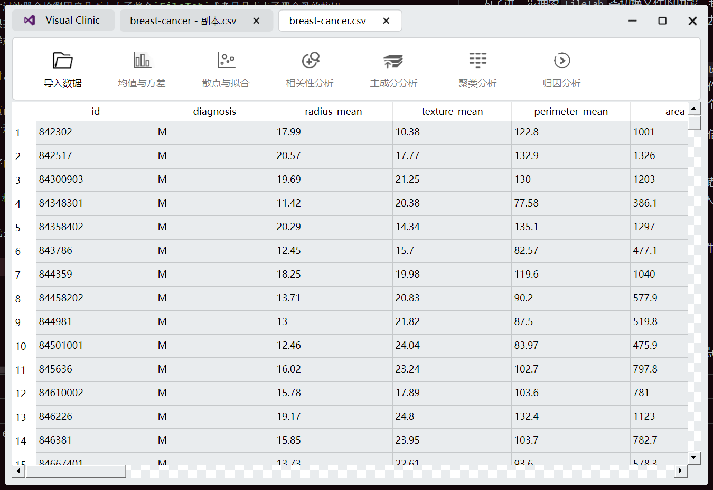

### 需求一：直方图

选中一列，只要点击表格中的数据，就会默认选中一列。这个时候，均值与方差的按钮就会被激活。点击之后就会弹出子页面。

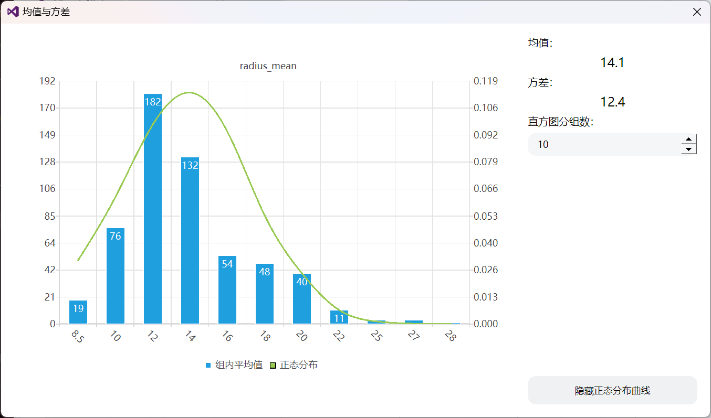

均值、方差与直方图和正态曲线都能够进行显示。

### 需求二：散点图与曲线拟合

选中两列后，散点与拟合的按钮会自动激活。点击后弹出子页面：

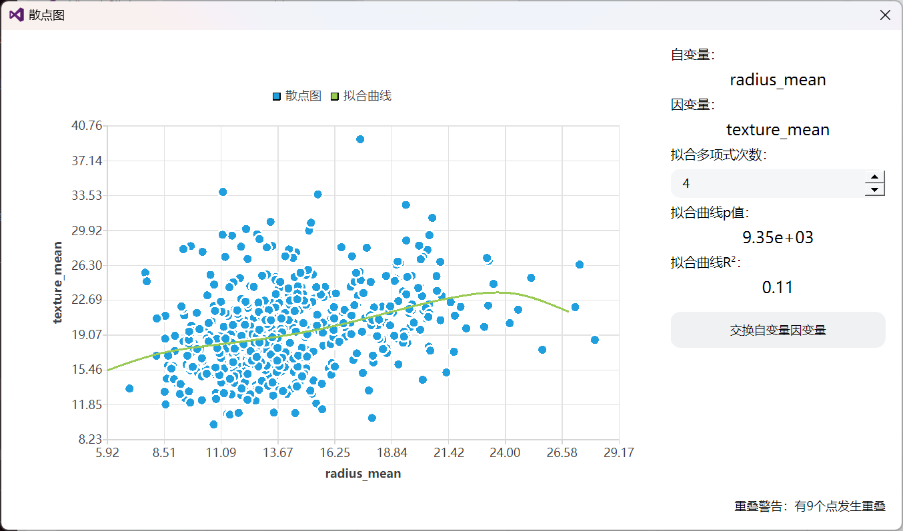

可以点击交换自变量因变量，来实现交换两列的效果

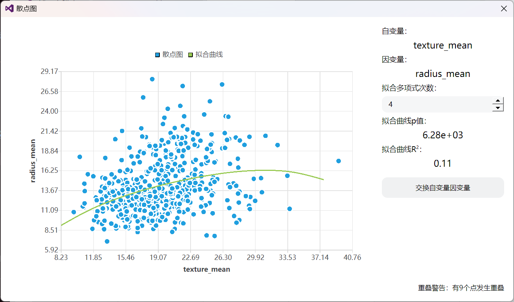

### 需求三：相关性与协方差矩阵

该按钮将被激活，当且仅当选中的列数大于等于2列。选中列后，点击该按钮，弹出子页面：

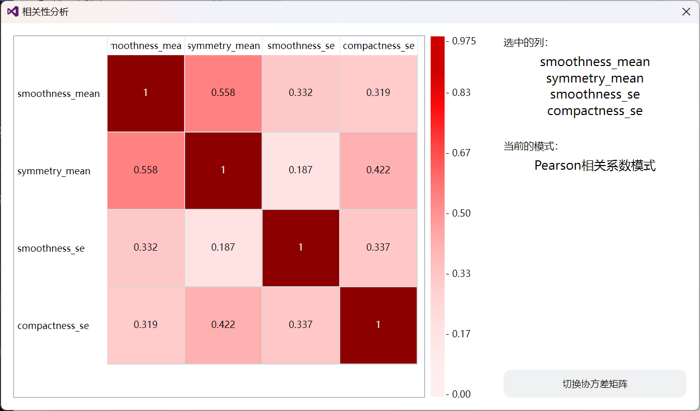

也可以点击按钮，切换展示协方差矩阵模式。

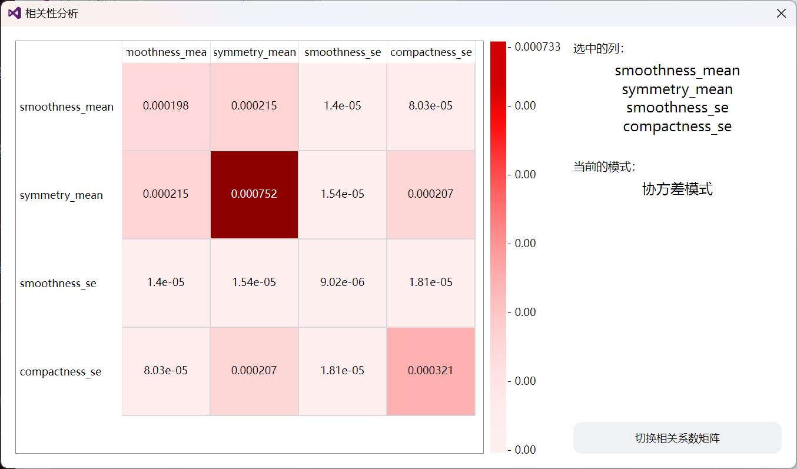

### 需求四：降维绘制

选中多列后，主成分分析按钮将被激活。点击该按钮，弹出子页面：

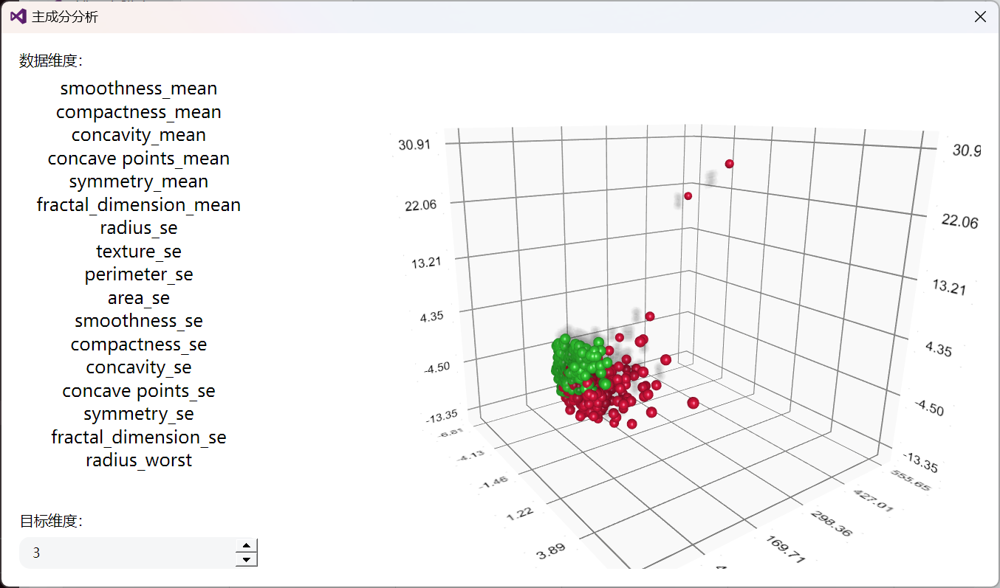

默认将显示将数据降维到三维后的结果，也可以调节`spinBox`的值来调节维度，以下是降维到2位的结果。

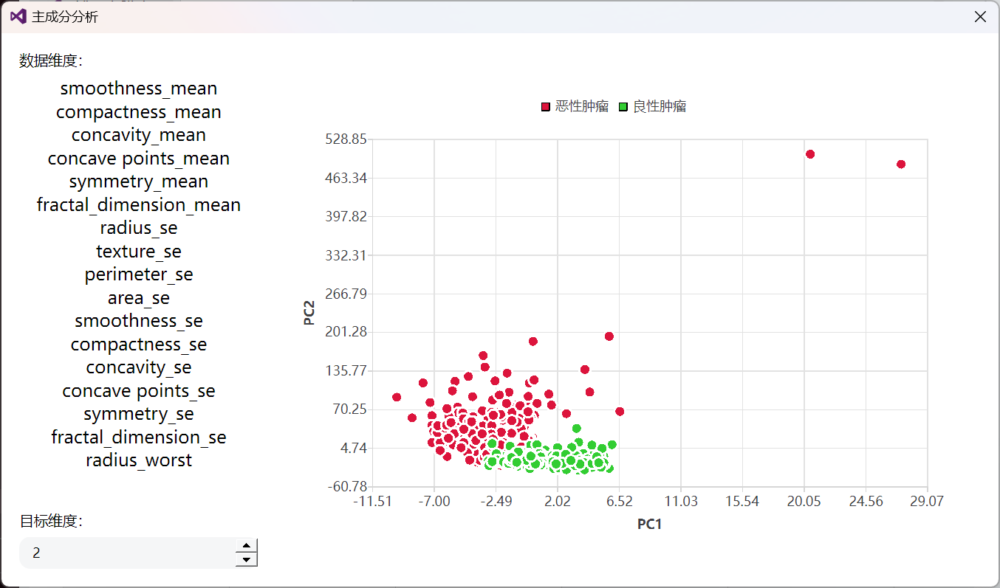

### 需求五：聚类分析

#### K-Means 目标维度：2


#### K-Means 目标维度：3

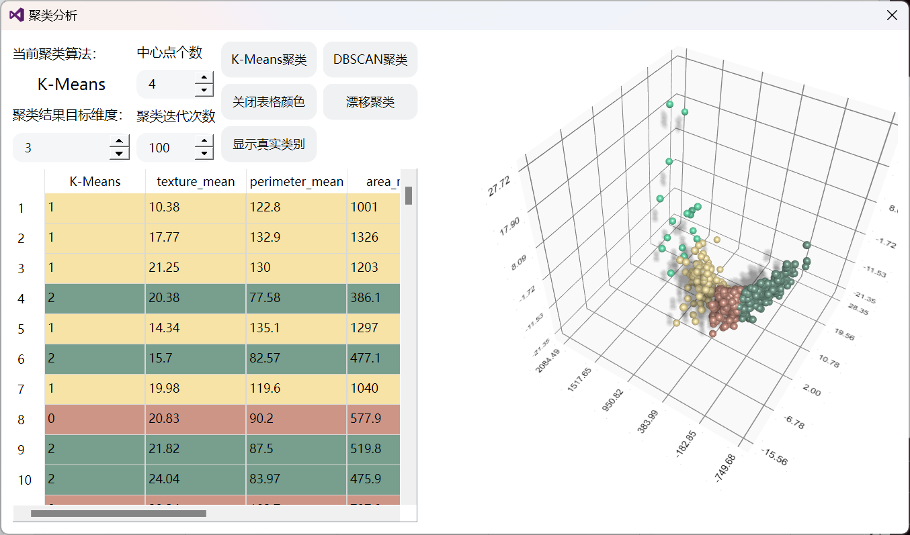

#### DBSCAN聚类 目标维度：2

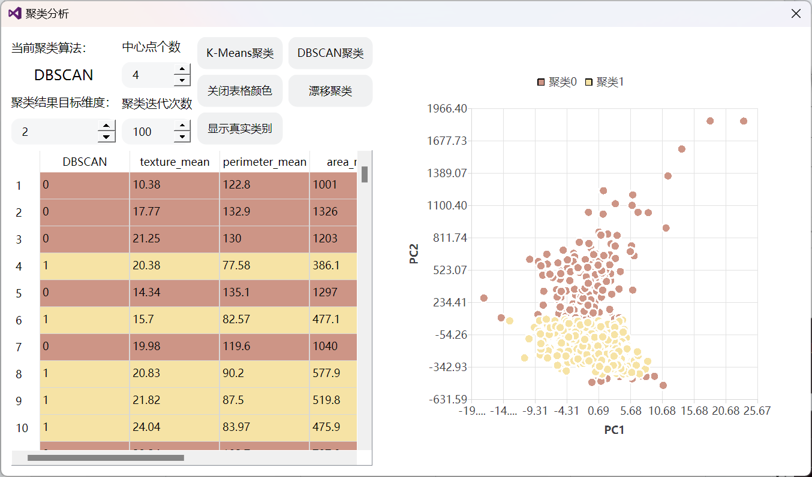

#### DBSCAN聚类 目标维度：3

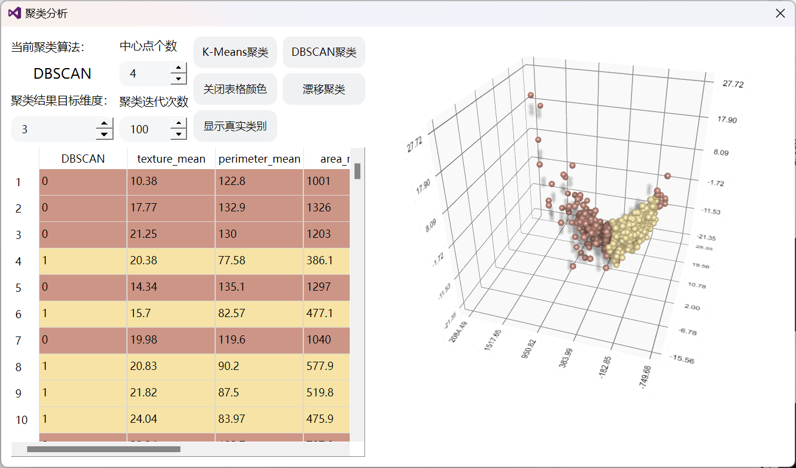

#### 漂移聚类 目标维度：2

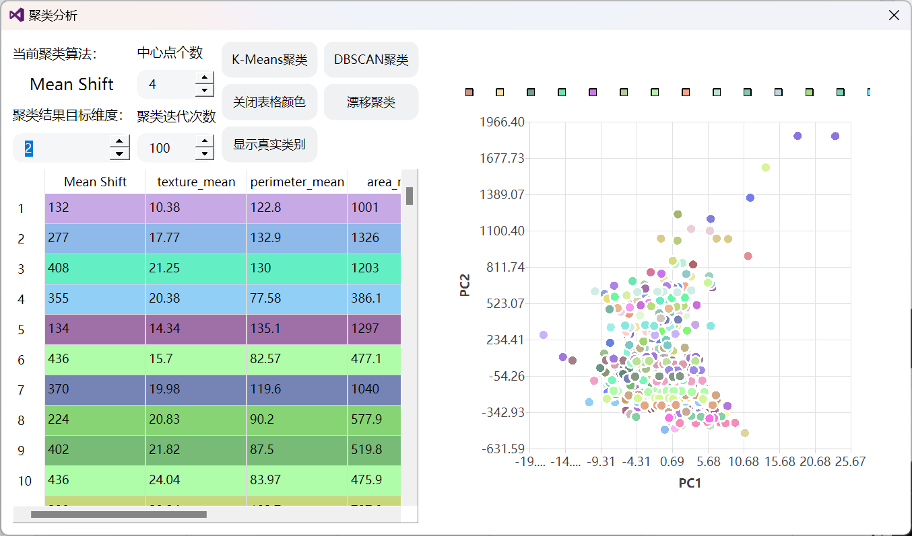

#### 漂移聚类 目标维度：3

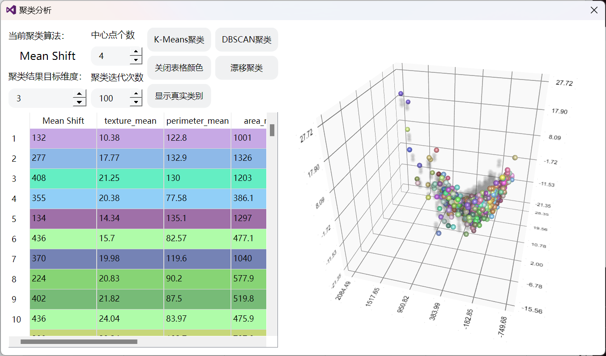

## 参考文献

> [Qt Source Code](https://github.com/qt/qtbase)
>
> [Qt Documentation](https://doc.qt.io/)