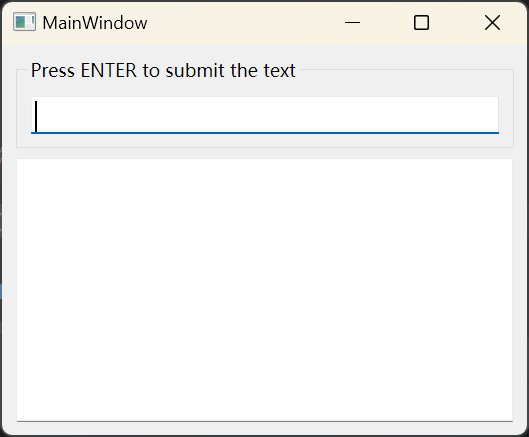
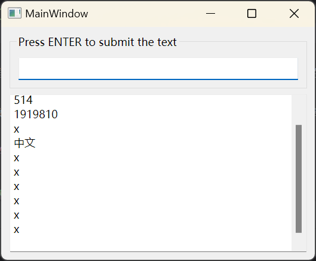

# 第五次作业第一题

## 如何编译运行

本项目使用`QT Creator`构建，代码在`Clion`中编写。要在`Clion`中编译运行项目，
首先应当在`CMakeLists.txt`中加入

```cmake
set(CMAKE_PREFIX_PATH "D:\\Qt\\6.5.2\\mingw_64")
```

来设置`qt cmake`的前缀路径。

接下来进入`Clion`的设置，新建一个`MinGW`工具链，
路径指向`D:\Qt\Tools\mingw1120_64`。

又由于运行项目时，我们的exe需要寻找qt的一些dll。所以我们又要修改环境变量。
直接修改系统的环境变量会搞乱我现有的一套`MinGW`配置，于是我们点开运行的`configure`，
直接在`ENVIRONMENTS`填入`PATH=D:\Qt\6.5.2\mingw_64\bin`。

此时即可完成编译调试与运行。

## 如何调试

首先前往`Toolchain`设置中将debugger从`Bundled`改为`MinGW`，然后前往
`Qt\Tools\mingw1120_64\etc`，修改`gdbinit`为

```shell
python
import sys
sys.path.insert(0, sys.path[0] + '/../share/gcc-11.2.0/python')
from libstdcxx.v6.printers import register_libstdcxx_printers
register_libstdcxx_printers (None)
end
```

即可正常调试。


## 程序运行结果






我使用多种QT自带的布局管理器管理了程序的布局，程序可以随意缩放，界面的控件也会跟随着变换。

在上面的LineEdit中输入文本后按下回车，文本将被清空，并且被添加到下方的TextEdit。
在添加文本时，TextEdit会自动将光标与scrollbar移动到文本末端。

## 可执行文件路径

可执行文件在`output`目录下，已使用windeployqt进行发布。
